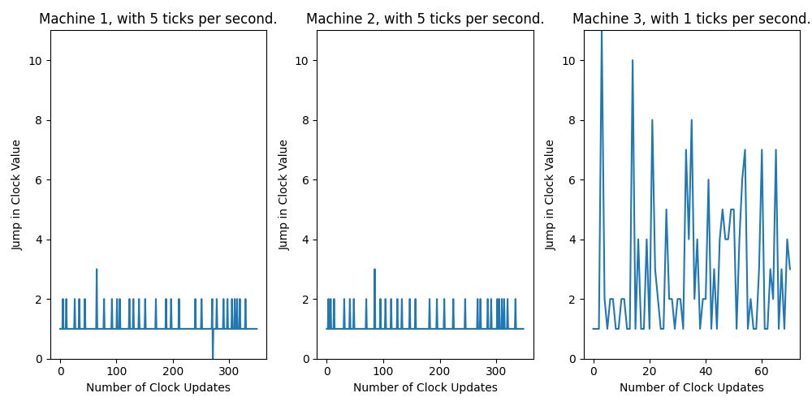

# Design Notebook: Scale Models and Logical Clocks ###

## Overall Design
We took inspiration from the sample code presented in section, and augmented it by making inter-machine connections bidirectional instead of solely unidirectional.

Our model consists of three Processes (representing intercommunicating virtual machines), each of which spawns:
- 1 machine thread to handle clock ticking and logical clock incrementation
- 1 server thread to listen for new connection requests
- 2 producer threads to send messages to each of the other machines

### Machine Thread
The `machine()` function takes in a configuration object (a Python `list`) as well as as optional arguments for tick rate (number of ticks per second) and the maximum operation number (inclusive; default is 10). Its purpose is to initialize the virtual machines by doing the following:
1. Defining locks and events for synchronization.
2. Declaring a global message queue for the machine.
3. Initializing the logical clock time and determining the tick duration either by using the tick rate, if specified, or using a random number generator.
4. Starting the server-side logic in a separate thread.
5. Clearing and initializing the log file.
6. Creating and connecting all producers (passed as a parameter to the function).
7. Starting a busy loop that generates operation codes and ticks.

### Server Thread
Each time the `server()` thread detects a new connection attempt, it spawns a new consumer thread responsible for socket message reception.

### Consumer Thread
As each machine has two "neighbor" machines, each machine will spawn 2 consumer threads, and as permitted in the assignment specification, each `consumer()` thread listens for and loads messages at system speed, not the randomly chosen tick rate of the virtual machines. It loads these messages into the global message queue (implemented as a Python `list`).

### Producer Thread
The `producer()` function takes in a client and server information, a log file name, and a thread number. The function defines the producer (client) logic by doing the following:

Each producer thread consists of a busy while loop containing the logic to determine which of the five operations to perform during a given clock tick:
1. send message to another machine,
2. send message to the other machine (i.e., not the machine from (1))
3. send message to both other machines
4. internal event
5. receive message

Broadly, the function goes:
1. Creating and connecting a socket to the server.
2. Waiting for a tick.
3. Getting the current operation number.
4. Checking if any other thread is receiving messages on this tick.
5. If received:
    - Receiving a message if the message queue is not empty for the fastest thread. In the case of message reception, the function updates the logical clock in accordance with the message receipt case of the Lamport Algorithm (i.e., the new logical clock value is the maximum of the timestamp of the message received and the current logical time, plus 1).
    - Logging that a message was received or sent.
6. Otherwise:
    - A random number generator (Python's `random.randrange` function) determines the operation per clock tick (clock tick duration is also randomly determined, using `1 / random.randrange(1, 7)`).

### Organization
To enhance organization and modularity, constants in our code are stored in `constants.py`, and useful thread functions (e.g., `machine`, `server`, `consumer`, and `producer`, among others) are stored in `utils.py`. The code to run the model is thus quite short, and all stored in `model.py`, which can be directly run in the terminal using `python model.py`.

## Thread Safety
### Locks
To ensure clean logging, mutex locks were used. This prevent multiple threads from writing to the logging file at once, and thereby resulting in overlapping, jumbled log messages. Similarly, to prevent race conditions with the message queue, the logical clock variable, and the operation code variable, a lock is required whenever an update or read operation is performed on any one of them (and in the case of the message queue, when an item is popped from the queue).

The locks in the code are as follow:
- `queue_lock`: For reading and updating the message queue.
- `log_file_lock`: For writing to the log file.
- `clock_lock`: For reading and updating the logical clock time.
- `op_lock`: For reading and updating the operation code.

### Events
Thread events were used to ensure that even though there are multiple producer threads per machine, only ONE event occurs per clock tick. This was rather complex to implement, and took much trial-and-error, and involved using `Event.wait()` calls within producers to ensure that threads only began once the clock tick loop set the `tick` event.

The code uses the following events:
- `tick`: This event is used within producers to signal that a clock tick loop has begun, and then cleared whenever a producer thread completes an iteration in the busy while loop.

- `receive`: This event serves the purpose of notifying the slower `producer` thread to not receive when the faster thread has already received a message. It is set when the faster thread finds that the message queue is not empty during a clock tick. It is cleared once the faster thread reaches the end of its iteration (effectively the end of the clock tick).

- `not_receive`: This event notifies the slower `producer` thread to not receive in the edge case that the queue becomes non-empty between the time in which the faster thread checks that it is empty and the slower thread checks that it is empty (if we did not have this check, the faster thread may find that the queue is empty, and possibly send a message, but then, in the same clock tick, the slower thread would receive a message -- this is TWO events in one clock tick, which is not desired). This event is set when the faster thread finds that the queue is empty and is cleared once either thread reaches the end of its iteration/end of clock tick.

## Logging
To make it simple for us to later analyze the results of our simulations, we logged each of the virtual machine's operations in CSV format in CSV files. Data are stored in columns in the order "Operation, Global Time, Logical Time, Length of Message Queue". Whereas Receive operations record the length of the message queue (before an item is popped), Send and Internal Event operations record the Length of Message Queue as "N/A", by default. This is done with our helper function `log_message()`. The function uses our `log_file_lock` to ensure that only one thread can write to the file at a time.

## Unit Testing
The unit test ensures that our program's log files exist and make logical sense.

## Analysis
In general, we found that virtual machines running on slower tick speed consistently had higher prevalence of message queue buildup and similarly more clock jumps (i.e., an incrementation of the logical clock by a value greater than 1 following one operation). This is likely due to the fact that faster tick speed virtual machines perform more operations per second, and are thus are capable of sending more messages to slower machines. As such, slower tick speed machines are often left "playing catch up" with the faster tick speed machines, where slower machines tend to perform a significantly higher proportion of Receive operations because in general, machines with slower tick speeds will have more messages in their message queues, as they are receiving messages at a slower rate than faster machines. Faster tick speed machines had greater proportions of Send and Internal Event operations, as expected.

The plots below demonstrate the change in logical clock value over each operation perform for a 1-minute simulation of three intercommunicating machines. In this model,
- Machine 1 had a tick duration of 0.167 sec
- Machine 2 had a tick duration of 1 sec
- Machine 3 had a tick duration of 0.2 sec

We can also examine the average logical clock jump for each machine (TODO: Can obtain by running second cell of `analysis.ipynb`):
- Machine 1 = 1.042
- Machine 2 = 3.704
- Machine 3 = 1.247

We also aggregated average logical clock jumps for four additional 1-minute simulations, shown below:

|          | Tick Duration (s)                               | Average Logical Clock Jump                      |
| Machine  | Trial 1 | Trial 2 | Trial 3 | Trial 4 | Trial 5 | Trial 1 | Trial 2 | Trial 3 | Trial 4 | Trial 5 |
| -------- | ------- | ------- | ------- | ------- | ------- | ------- | ------- | ------- | ------- | ------- |
| 1        | 0.167   | 0.167   | 1.00    | 0.200   | 0.167   | 1.012   | 1.000   | 2.567   | 1.220   | 1.000   |
| 2        | 1.00    | 0.500   | 0.333   | 0.167   | 1.00    | 3.200   | 2.847   | 1.931   | 1.020   | 4.667   |
| 3        | 0.167   | 0.333   | 0.167   | 0.250   | 1.00    | 1.012   | 1.955   | 1.000   | 1.431   | 4.550   |

Hence, we see that machines with slower tick speeds (high tick duration) generally have higher average logical clock jumps, and this is due to the nature of the Lamport Algorithm -- faster tick speed machines will inherently increment their logical clocks more often, and thus slower tick speed machines, when they receive messages from these faster machines, will generally have an internal logical clock value smaller than that of the timestamp of the message they received. Hence, they will update their logical clock to be the maximum of these two values, plus 1, thereby resulting in noticeable jumps, to keep as synchronized as possible with the faster machines. It must be noted that even the fastest tick speed machine(s) also experienced logical clock jumps as well, and this is likely due to the fact that the Lamport Algorithm is designed to ensure causal ordering of events, rather than real-time ordering. Therefore, even in a system where all machines have the same tick speed, logical clock jumps may still occur if messages are received out of order or if there are delays in message transmission. Additionally, in a distributed system with multiple machines, there may be inherent variability in network latency and processing speed that can contribute to logical clock jumps. However, in general, machines with slower tick speeds will experience more noticeable logical clock jumps due to the "catch up" effect described earlier.

In additional experiments we did, the collection of graphs displayed above depict the five distinct runs of a set of virtual machines, with the clock value plotted against the number of clock updates that have taken place. The number of updates to the clock is determined by the length of the logs for the port. It is expected that the machine with the highest rate constants will have the most consistent and highest number of updates to the clock. Each graph shows that the line corresponding to the highest rate constant is the smoothest, while the other lines progress less smoothly towards the final clock value. The slope of the lines is approximately proportional to the ratio between the rate values, as the rate value determines the number of operations per second in the real world, which in turn affects the progression speed of the clock value and the number of clock updates. When the rate constants of each machine are similar, the lines progress similarly towards the final clock value, whereas highly different rate constants lead to very different slopes and smoothness, as can be seen in the third graph where two machines have a rate constant of 5 and one machine has a rate constant of 1. The machine with rate constant 1 required approximately 75 updates to reach the final clock value of 350, while the machines with rate constant 5 required around 350 updates. This is expected since the clock value of the machine with rate constant 1 will update to the maximum of the two machines whenever a message is received from another machine, resulting in fewer updates required, whereas the clock values of the machines with rate constant 5 will progress much faster since there are around 5 times as many operations occurring.

The above graphs depict the results of 5 different runs of virtual machines, where the jump in the clock value is plotted against the number of updates to the clock. It is expected that machines with lower rate constants will have higher jumps in clock value, as machines with higher rate constants will progress much faster, resulting in fewer jumps. Therefore, when a machine with a lower rate constant receives a message, its clock value will update to the maximum of the two, causing a jump in the clock value. The rate constant determines the number of operations per real-world second, thus machines with higher rate constants will have a faster progression in clock value. As shown in the graphs, machines with higher rate constants have fewer clock jumps, while those with lower rate constants have larger jumps. For instance, in the first row of graphs, the machine with a rate constant of 5 has no to little clock jumps, while the maximum clock jumps occur when the rate constant is 2. This pattern aligns with the expected behavior that larger clock jumps occur when the differences in rate constants between machines are larger.

Our experimentation code can be found in analysis.ipynb.